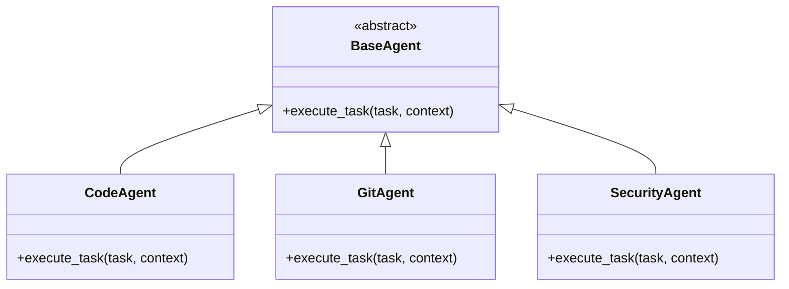

# Diagramme de classes - Agents

```mermaid
classDiagram
%% source: app/agents
class BaseAgent {
  <<abstract>>
  +execute_task(task, context)
}
class CodeAgent {
  +execute_task(task, context)
}
class GitAgent {
  +execute_task(task, context)
}
class SecurityAgent {
  +execute_task(task, context)
}
BaseAgent <|-- CodeAgent
BaseAgent <|-- GitAgent
BaseAgent <|-- SecurityAgent
```
