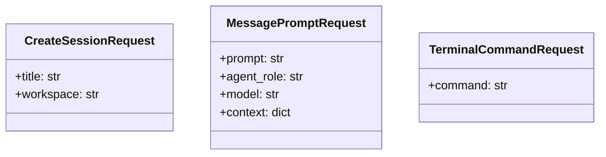

# Diagramme de classes - API

```mermaid
classDiagram
%% source: app/api
class CreateSessionRequest {
  +title: str
  +workspace: str
}
class MessagePromptRequest {
  +prompt: str
  +agent_role: str
  +model: str
  +context: dict
}
class TerminalCommandRequest {
  +command: str
}
```
