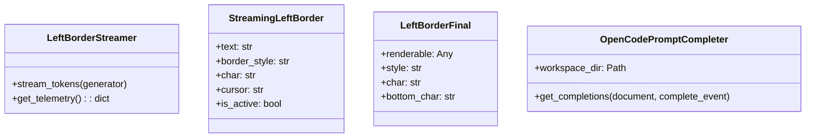

# Diagramme de classes - CLI

```mermaid
classDiagram
%% source: app/cli
class LeftBorderStreamer {
  +stream_tokens(generator)
  +get_telemetry(): dict
}
class StreamingLeftBorder {
  +text: str
  +border_style: str
  +char: str
  +cursor: str
  +is_active: bool
}
class LeftBorderFinal {
  +renderable: Any
  +style: str
  +char: str
  +bottom_char: str
}
class OpenCodePromptCompleter {
  +workspace_dir: Path
  +get_completions(document, complete_event)
}
```
