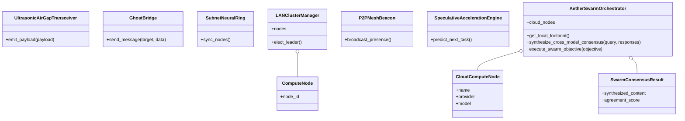

# Diagramme de classes - Cluster

```mermaid
classDiagram
%% source: app/cluster
class UltrasonicAirGapTransceiver {
  +emit_payload(payload)
}
class GhostBridge {
  +send_message(target, data)
}
class SubnetNeuralRing {
  +sync_nodes()
}
class ComputeNode {
  +node_id
}
class LANClusterManager {
  +nodes
  +elect_leader()
}
class P2PMeshBeacon {
  +broadcast_presence()
}
class SpeculativeAccelerationEngine {
  +predict_next_task()
}
class CloudComputeNode {
  +name
  +provider
  +model
}
class SwarmConsensusResult {
  +synthesized_content
  +agreement_score
}
class AetherSwarmOrchestrator {
  +cloud_nodes
  +get_local_footprint()
  +synthesize_cross_model_consensus(query, responses)
  +execute_swarm_objective(objective)
}
LANClusterManager o-- ComputeNode
AetherSwarmOrchestrator o-- CloudComputeNode
AetherSwarmOrchestrator o-- SwarmConsensusResult
```
