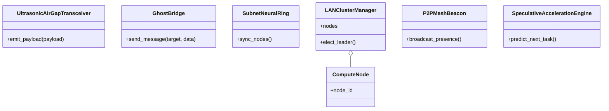

# Diagramme de classes - Cluster

```mermaid
classDiagram
%% source: app/cluster
class UltrasonicAirGapTransceiver {
  +emit_payload(payload)
}
class GhostBridge {
  +send_message(target, data)
}
class SubnetNeuralRing {
  +sync_nodes()
}
class ComputeNode {
  +node_id
}
class LANClusterManager {
  +nodes
  +elect_leader()
}
class P2PMeshBeacon {
  +broadcast_presence()
}
class SpeculativeAccelerationEngine {
  +predict_next_task()
}
LANClusterManager o-- ComputeNode
```
