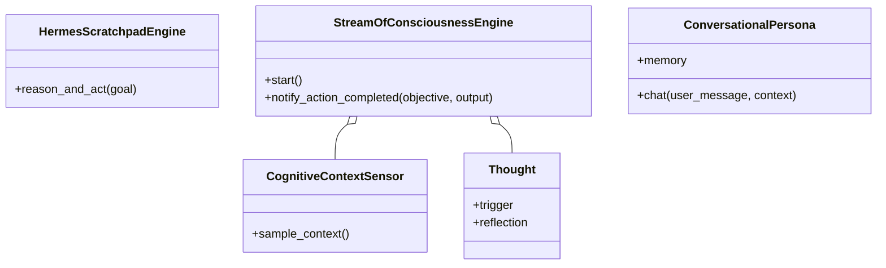

# Diagramme de classes - Cognition

```mermaid
classDiagram
%% source: app/cognition
class HermesScratchpadEngine {
  +reason_and_act(goal)
}
class Thought {
  +trigger
  +reflection
}
class CognitiveContextSensor {
  +sample_context()
}
class StreamOfConsciousnessEngine {
  +start()
  +notify_action_completed(objective, output)
}
class ConversationalPersona {
  +memory
  +chat(user_message, context)
}
StreamOfConsciousnessEngine o-- CognitiveContextSensor
StreamOfConsciousnessEngine o-- Thought
```
