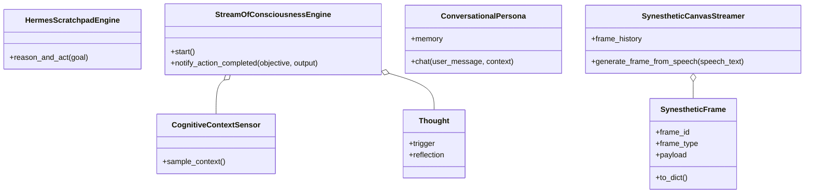

# Diagramme de classes - Cognition

```mermaid
classDiagram
%% source: app/cognition
class HermesScratchpadEngine {
  +reason_and_act(goal)
}
class Thought {
  +trigger
  +reflection
}
class CognitiveContextSensor {
  +sample_context()
}
class StreamOfConsciousnessEngine {
  +start()
  +notify_action_completed(objective, output)
}
class ConversationalPersona {
  +memory
  +chat(user_message, context)
}
class SynestheticFrame {
  +frame_id
  +frame_type
  +payload
  +to_dict()
}
class SynestheticCanvasStreamer {
  +frame_history
  +generate_frame_from_speech(speech_text)
}
StreamOfConsciousnessEngine o-- CognitiveContextSensor
StreamOfConsciousnessEngine o-- Thought
SynestheticCanvasStreamer o-- SynestheticFrame
```
