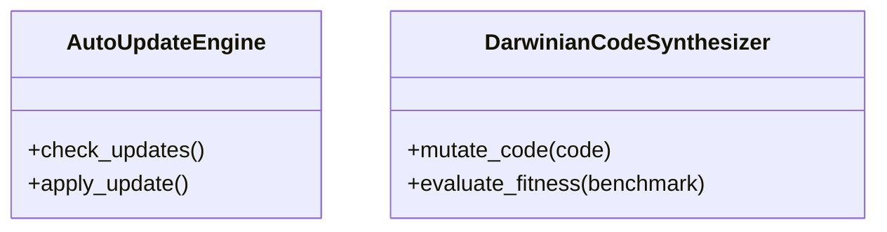

# Diagramme de classes - Évolution

```mermaid
classDiagram
%% source: app/evolution
class AutoUpdateEngine {
  +check_updates()
  +apply_update()
}
class DarwinianCodeSynthesizer {
  +mutate_code(code)
  +evaluate_fitness(benchmark)
}
```
