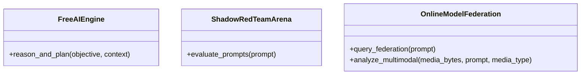

# Diagramme de classes - LLM

```mermaid
classDiagram
%% source: app/llm
class FreeAIEngine {
  +reason_and_plan(objective, context)
}
class ShadowRedTeamArena {
  +evaluate_prompts(prompt)
}
class OnlineModelFederation {
  +query_federation(prompt)
  +analyze_multimodal(media_bytes, prompt, media_type)
}
```
