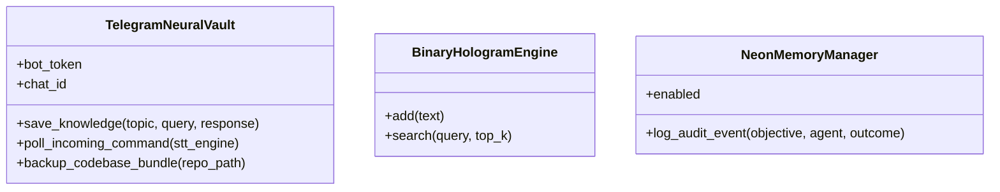

# Diagramme de classes - Mémoire

```mermaid
classDiagram
%% source: app/memory
class TelegramNeuralVault {
  +bot_token
  +chat_id
  +save_knowledge(topic, query, response)
  +poll_incoming_command(stt_engine)
  +backup_codebase_bundle(repo_path)
}
class BinaryHologramEngine {
  +add(text)
  +search(query, top_k)
}
class NeonMemoryManager {
  +enabled
  +log_audit_event(objective, agent, outcome)
}
```
