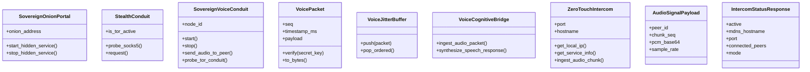

# Diagramme de classes - Réseau

```mermaid
classDiagram
%% source: app/network
class SovereignOnionPortal {
  +onion_address
  +start_hidden_service()
  +stop_hidden_service()
}
class StealthConduit {
  +is_tor_active
  +probe_socks5()
  +request()
}
class SovereignVoiceConduit {
  +node_id
  +start()
  +stop()
  +send_audio_to_peer()
  +probe_tor_conduit()
}
class VoicePacket {
  +seq
  +timestamp_ms
  +payload
  +verify(secret_key)
  +to_bytes()
}
class VoiceJitterBuffer {
  +push(packet)
  +pop_ordered()
}
class VoiceCognitiveBridge {
  +ingest_audio_packet()
  +synthesize_speech_response()
}
class ZeroTouchIntercom {
  +port
  +hostname
  +get_local_ip()
  +get_service_info()
  +ingest_audio_chunk()
}
class AudioSignalPayload {
  +peer_id
  +chunk_seq
  +pcm_base64
  +sample_rate
}
class IntercomStatusResponse {
  +active
  +mdns_hostname
  +port
  +connected_peers
  +mode
}
```
