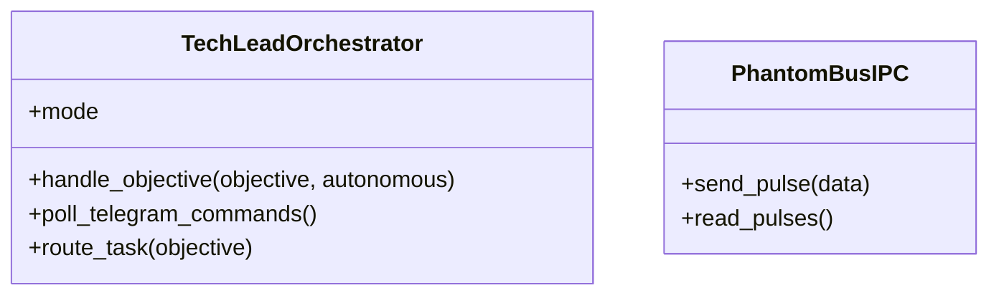

# Diagramme de classes - Orchestrateur

```mermaid
classDiagram
%% source: app/orchestrator
class TechLeadOrchestrator {
  +mode
  +handle_objective(objective, autonomous)
  +poll_telegram_commands()
  +route_task(objective)
}
class PhantomBusIPC {
  +send_pulse(data)
  +read_pulses()
}
```
