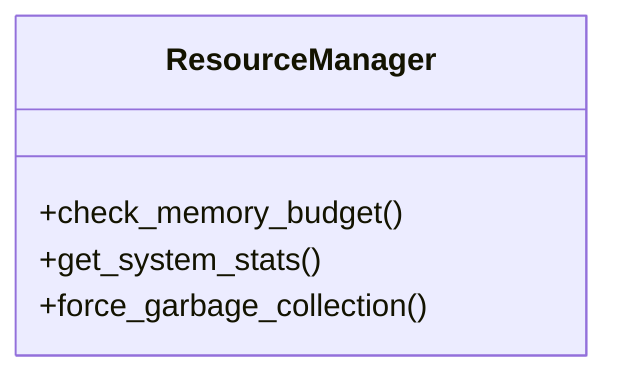

# Diagramme de classes - Gestionnaire de Ressources

```mermaid
classDiagram
%% source: app/resource_manager
class ResourceManager {
  +check_memory_budget()
  +get_system_stats()
  +force_garbage_collection()
}
```
