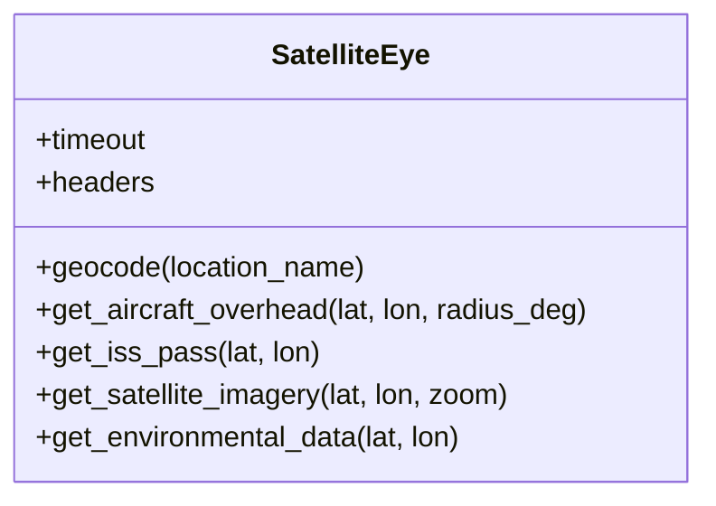

# Diagramme de classes - Satellite

```mermaid
classDiagram
%% source: app/satellite
class SatelliteEye {
  +timeout
  +headers
  +geocode(location_name)
  +get_aircraft_overhead(lat, lon, radius_deg)
  +get_iss_pass(lat, lon)
  +get_satellite_imagery(lat, lon, zoom)
  +get_environmental_data(lat, lon)
}
```
