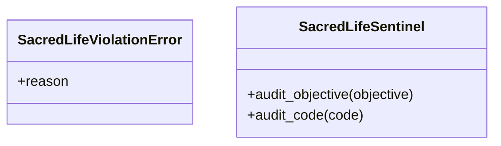

# Diagramme de classes - Sécurité

```mermaid
classDiagram
%% source: app/security
class SacredLifeViolationError {
  +reason
}
class SacredLifeSentinel {
  +audit_objective(objective)
  +audit_code(code)
}
```
