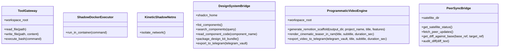

# Diagramme de classes - Outils

```mermaid
classDiagram
%% source: app/tools
class ToolGateway {
  +workspace_root
  +read_file(path)
  +write_file(path, content)
  +execute_bash(command)
}
class ShadowDockerExecutor {
  +run_in_container(command)
}
class KineticShadowNetns {
  +isolate_network()
}
class DesignSystemBridge {
  +shadcn_home
  +list_components()
  +search_components(query)
  +read_component_code(component_name)
  +package_design_kit_bundle()
  +export_to_telegram(telegram_vault)
}
class ProgrammaticVideoEngine {
  +workspace_root
  +generate_remotion_scaffold(output_dir, project_name, title, features)
  +render_cinematic_teaser_in_ram(title, subtitle, duration_sec)
  +export_video_to_telegram(telegram_vault, title, subtitle, duration_sec)
}
class PeerSyncBridge {
  +satellite_dir
  +get_satellite_status()
  +fetch_peer_updates()
  +get_diff_against_base(base_ref, target_ref)
  +audit_diff(diff_text)
}
```
