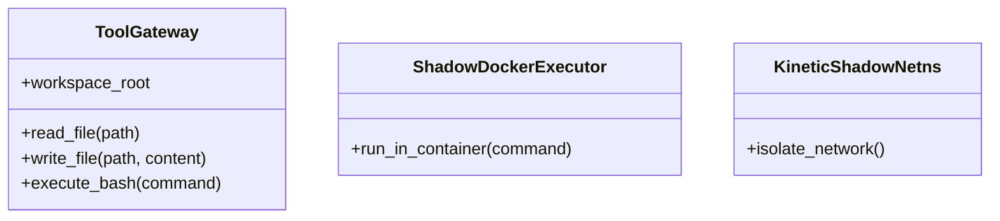

# Diagramme de classes - Outils

```mermaid
classDiagram
%% source: app/tools
class ToolGateway {
  +workspace_root
  +read_file(path)
  +write_file(path, content)
  +execute_bash(command)
}
class ShadowDockerExecutor {
  +run_in_container(command)
}
class KineticShadowNetns {
  +isolate_network()
}
```
