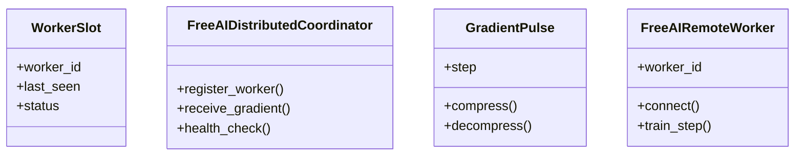

# Diagramme de classes - Training

```mermaid
classDiagram
%% source: app/training
class WorkerSlot {
  +worker_id
  +last_seen
  +status
}
class FreeAIDistributedCoordinator {
  +register_worker()
  +receive_gradient()
  +health_check()
}
class GradientPulse {
  +step
  +compress()
  +decompress()
}
class FreeAIRemoteWorker {
  +worker_id
  +connect()
  +train_step()
}
```
