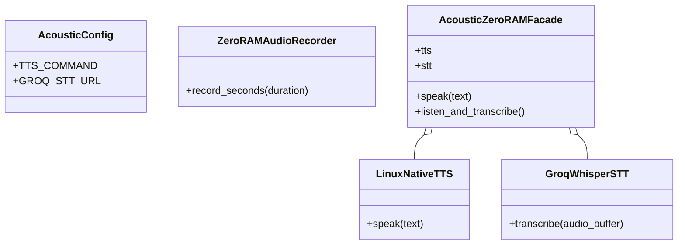

# Diagramme de classes - Voix

```mermaid
classDiagram
%% source: app/voice
class AcousticConfig {
  +TTS_COMMAND
  +GROQ_STT_URL
}
class ZeroRAMAudioRecorder {
  +record_seconds(duration)
}
class GroqWhisperSTT {
  +transcribe(audio_buffer)
}
class LinuxNativeTTS {
  +speak(text)
}
class AcousticZeroRAMFacade {
  +tts
  +stt
  +speak(text)
  +listen_and_transcribe()
}
AcousticZeroRAMFacade o-- LinuxNativeTTS
AcousticZeroRAMFacade o-- GroqWhisperSTT
```
