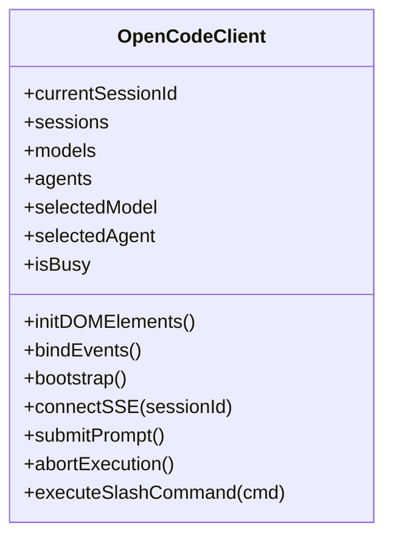

# Diagramme de classes - Web UI

```mermaid
classDiagram
%% source: app/web
class OpenCodeClient {
  +currentSessionId
  +sessions
  +models
  +agents
  +selectedModel
  +selectedAgent
  +isBusy
  +initDOMElements()
  +bindEvents()
  +bootstrap()
  +connectSSE(sessionId)
  +submitPrompt()
  +abortExecution()
  +executeSlashCommand(cmd)
}
```
